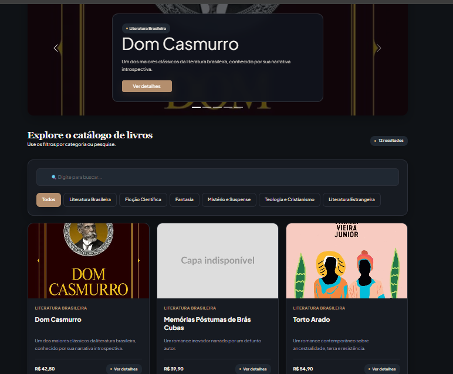
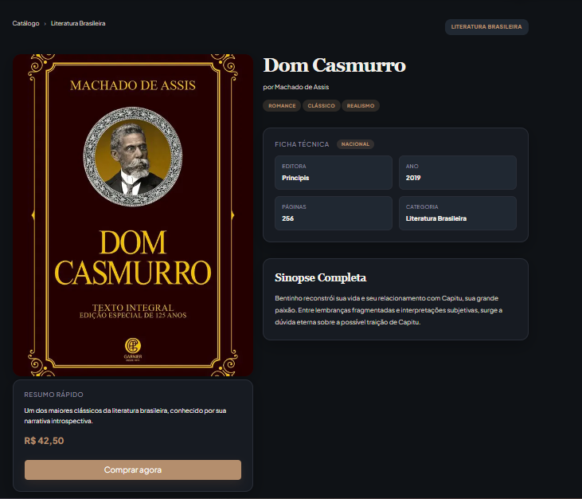

# Trabalho Prático - Semana 13

Nesta etapa, você irá evoluir o projeto do semestre, montando um ambiente de desenvolvimento mais completo, típico de projetos profissionais. Nesse processo, vamos utilizar um **servidor backend simulado** com o JSON Server, que fornece uma APIs RESTful a partir de um arquivo JSON.

Para este projeto, além de migrarmos do JSON para o JSON Server, vamos permitir o cadastro e a alteração dos dados da entidade principal (CRUD).

## Informações Gerais

- Nome: Felipe de Carvalho Andrade
- Matrícula: 902883
- Proposta de projeto escolhida: **Temas e Conteúdos Associados**  
- Breve descrição sobre seu projeto: Este projeto é uma aplicação web de catálogo de livros, organizada por categorias literárias como Literatura Brasileira, Ficção Científica, Mistério e Suspense, entre outras. Cada livro possui informações  detalhadas, incluindo título, autor, sinopse, descrição, editora, ano de publicação, número de páginas e imagem de capa. Além disso, cada livro possui um botão que leva para o site da Amazon para realizar a compra do livro

## Prints do Trabalho

### Interface Completa (Home-Page)
<p align="center">
  
</p>

<p align="center">
  <em>Figura 1: Visão geral da página principal apresentando o banner rotativo de destaques, barra de pesquisa, filtros por categorias e a grade de livros disponíveis no catálogo.</em>
</p>

---

### Detalhes do Produto
<p align="center">
  
</p>

<p align="center">
  <em>Figura 2: Visualização da página interna de uma obra exibindo a capa, resumo rápido, link para compra, ficha técnica estruturada (Editora, Ano, Páginas, Origem), a sinopse completa e a seção de recomendações "Você Também Pode Gostar".</em>
</p>

---

## Dados em JSON

A aplicação é alimentada dinamicamente por uma base de dados simulada utilizando o JSON Server, configurada no arquivo `db.json`. A estrutura conta com duas coleções principais:

* **`livros`**: Coleção principal que armazena todos os produtos do catálogo. Cada objeto contém dados estruturais detalhados da obra (título, autor, preços, descrições longa e curta), flags booleanas (`destaque`) e metadados fundamentais (páginas, editora, ano e arrays de tags).
* **`categorias`**: Coleção de apoio que mantém a lista das categorias literárias disponíveis (ex: Literatura Brasileira, Fantasia, Ficção Científica) para manter a padronização e estruturação dos dados.

Abaixo está apresentado um modelo de exemplo contendo um item de cada coleção da nossa base de dados:

```json
{
  "livros": [
    {
      "id": 1,
      "titulo": "Dom Casmurro",
      "autor": "Machado de Assis",
      "categoria": "Literatura Brasileira",
      "origem": "Nacional",
      "descricaoCurta": "Um dos maiores clássicos da literatura brasileira, conhecido por sua narrativa introspectiva.",
      "descricaoCompleta": "Bentinho reconstrói sua vida e seu relacionamento com Capitu, sua grande paixão. Entre lembranças fragmentadas e interpretações subjetivas, surge a dúvida eterna sobre a possível traição de Capitu.",
      "imagem": "https://images.tcdn.com.br/img/img_prod/1271663/dom_casmurro_edicao_de_luxo_almofadada_89_1_038fb70c564eb50f71ea49f6027e827a.jpg",
      "preco": 42.50,
      "tags": [
        "Romance",
        "Clássico",
        "Realismo"
      ],
      "destaque": true,
      "paginas": 256,
      "editora": "Principis",
      "anoPublicacao": 2019,
      "anoEscrita": 1899
    }
  ],
  "categorias": [
    {
      "id": 1,
      "nome": "Literatura Brasileira"
    }
  ]
}
```

## **Orientações Gerais**

Nesse projeto você vai encontrar a seguinte estrutura base:

* **Pasta db**
  Essa pasta contém um único arquivo: `db.json`. Esse arquivo serve de banco de dados simulado e nele você deve colocar as estruturas de dados que o seu projeto manipula.
  * **OBS**: Já incluímos a estrutura de usuários como exemplo e para que você possa utilizar no seu projeto. Se precisar, faça os ajustes necessários para seu projeto.
* **Pasta public**
  Nessa pasta você deve colocar todos os arquivos do seu site (front end). Aqui vão os arquivos HTML, CSS, JavaScript, imagens, vídeos e tudo o mais que precisar para a interface do usuário.
* **Arquivo README.md**
  Nesse arquivo é onde são colocadas as informações de quem está desenvolvendo o projeto e os registros solicitados no enunciado da tarefa.
* **Arquivo .gitignore**
  Configuração do que deve ser ignorado pelo git evitando que seja enviado para o servidor no GitHub.
* **Arquivo package.json**
  Considerado o manifesto do projeto ou arquivo de configuração. Nele são incluídas as informações básicas sobre o projeto (descrição, versão, palavras-chave, licença, copyright), a lista de pacotes dos quais o projeto depende tanto para desenvolvimento quanto execução, uma lista de  scripts do projeto, entre outras opções.
  * **OBS**: Esse arquivo é criado assim que o projeto é iniciado por meio do comando `npm init`.
  * **OBS2**: Esse arquivo já traz a informação de necessidade do JSONServer.
* **Pasta node_modules**
  Local onde ficam os pacotes dos quais o projeto depende. Evite enviar essa pasta para o repositório remoto. Essa pasta é reconstruída toda vez que se executa o comando `npm install`.

**Ambiente de desenvolvimento (IMPORTANTE)**

> A partir de agora, **NÃO utilizamos mais o LiveServer/FiveServer** durante o processo de desenvolvimento. O próprio JSONServer faz o papel de servidor.

Para iniciar o JSONServer e acessar os arquivos do seu site, siga os seguintes passos:

1. Abra a pasta do projeto dentro da sua IDE (por exemplo, Visual Studio Code)
2. Abra uma janela de terminal e certifique-se que a pasta do terminal é a pasta do projeto
3. Execute o comando `npm install`
   Isso vai reconstruir a pasta node_modules e instalar todos os pacotes necessários para o nosso ambiente de desenvolvimento (Ex: JSONServer).
4. Execute o comando `npm start`
   Isso vai executar o JSONServer e permitir que você consiga acessar o seu site no navegador.
5. Para testar o projeto:
   1. **Site Front End**: abra um navegador e acesse o seu site pela seguinte URL: 
      [http://localhost:3000]()
   2. **Site Back End**: abra o navegador e acesse as informações da estrutura de usuários por meio da API REST do JSONServer a partir da seguinte URL: 
      [http://localhost:3000/usuarios](http://localhost:3000/usuarios)

Ao criar suas estruturas de dados no arquivo db.json, você poderá obter estes dados através do endereço: http://localhost:3000/SUA_ESTRUTURA, tal qual como foi feito com a estrutura de usuários. **IMPORTANTE**: Ao editar o arquivo db.json, é necessário parar e reiniciar o JSONServer.

**IMPORTANTE:** Assim como informado anteriormente, capriche nesta etapa, pois você vai precisar dessa parte para as próximas semanas. 

**IMPORTANTE:** Você deve trabalhar:

* na pasta **`public`,** para os arquivos de front end, mantendo os arquivos **`index.html`**, **`detalhes.html`**, **`styles.css`** e **`app.js`** com estes nomes, e
* na pasta **`db`**, com o arquivo `db.json`.

Deixe todos os demais arquivos e pastas desse repositório inalterados. **PRESTE MUITA ATENÇÃO NISSO.**
